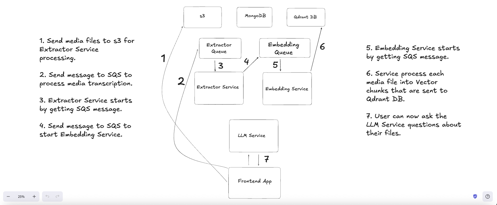

# 🧠 [AlwaysSaved Frontend](https://github.com/jaimemendozadev/alwayssaved-fe-app)

Welcome to the **AlwaysSaved** Next.js Frontend — the user-facing web app that powers your private, searchable knowledge base for long-form media. Built to deliver fast, intelligent, and intuitive experiences, this interface lets users upload, explore, and query their personal content with ease.

---

## Table of Contents (TOC)

- [What is AlwaysSaved](#-what-is-alwayssaved)
- [3rd Party Services Needed](#3rd-party-services-needed)
- [Environment Variables](#environment-variables)
- [AWS Systems Manager Parameter Store Variables](#aws-systems-manager-parameter-store-variables)
- [AlwaysSaved System Design / App Flow](#alwayssaved-system-design--app-flow)

---

## ⚡ What is AlwaysSaved?

**AlwaysSaved** is your **second brain for your media files** — transforming unsearchable media into instantly usable knowledge.

> Upload once, ask questions forever.

Whether it’s a Zoom call, a lecture, or a YouTube clip, AlwaysSaved uses cutting-edge AI to make your content **searchable**, **understandable**, and **interactive**.

[Back to TOC](#table-of-contents-toc)

---

## 🔍 Key Features

- 🎙️ **AI-Powered Transcription**  
  Converts speech to clean, readable text using [OpenAI's Whisper](https://openai.com/research/whisper).

- 🧠 **Semantic Search**  
  Vectorized content indexed via [Qdrant](https://qdrant.tech/) enables deep, context-aware search.

- 🤖 **Natural Language Q&A (RAG)**  
  Ask any question and get accurate answers pulled directly from your files using Retrieval-Augmented Generation.

- 🚀 **Drag-and-Drop Uploads**  
  Upload media files* effortlessly. Let the backend handle the heavy lifting.
  (*Video files for now in v1)

- 🔒 **Private & Secure**  
  All your media and queries stay private — no data scraping, no leaks.

- 🌐 **Multilingual Support**  
  Works with English, Spanish, and other Whisper-supported languages.

- ⚡ **GPU-Powered Performance**  
  Transcoding and processing happens quickly thanks to cloud-hosted NVIDIA GPUs.


[Back to TOC](#table-of-contents-toc)

---


## 3rd Party Services Needed

This app requires quite a few services in order for you to play with it on your local machine 👩🏽‍💻. You'll need to setup:

- A <a href="https://www.mongodb.com/products/platform/atlas-database" target="_blank">MongoDB Database</a> with the right IP Address permissions;
- A <a href="https://clerk.com/" target="_blank">Clerk.com</a> account for authentication;
- A <a href="https://qdrant.tech/" target="_blank">Qdrant</a> Vector database;
- An <a href="https://aws.amazon.com/" target="_blank">AWS User Account</a> that has admin access; and
- The following AWS Resources: 
  - An <a href="https://aws.amazon.com/s3/" target="_blank">S3 Bucket</a> with the right permissions for storing media files.
  - Parameters stored in the <a href="https://aws.amazon.com/systems-manager/" target="_blank">AWS Systems Manager Parameter Store</a>.
  - Amazon <a href = "https://aws.amazon.com/sqs/" target="_blank">Simple Queue Service</a> for sending payloads to the Extractor Queue that kicks off the ML/AI Pipeline.

<strong>IMPORTANT</strong>: 👆🏽 For the services I mentioned, I expect you to have some knowledge on how to setup the services yourself or do the requisite research on how to set them up properly to fill out the environment variables mentioned in the section below 👇🏽.

[Back to TOC](#table-of-contents-toc)

---


## Environment Variables

In order to setup the app for local development, you'll need to prefill all the required Environment Variables and a couple variables in the AWS Parameter Store (<a href="#aws-systems-manager-parameter-store-variables">see next section</a>).

Once you've finished setting up all the 3rd party services, you'll need to create an `.env.local` file in the root of the project so the app can work properly.

You'll need to prefill the `.env.local` file with values from the 3rd party services you setup.

For example:

- You'll need to specify the `REGION`, the name of your S3 `BUCKET`, etc.
- You'll need to specify all the `MONGO_DB_` variables from your MongoDB Cluter so you can connect to the running instance of your database.
- Notice you also need to have setup a <a href="https://qdrant.tech/" target="_blank">Qdrant</a> Database ahead of time with the name of your collection. Your Qdrant connection details need to be stored in the AWS Parameter Store (<a href="#aws-systems-manager-parameter-store-variables">see next section</a>).

Here's a list of all the env variables you'll need in the file, with some of the variables already prefilled for you:

```

NEXT_PUBLIC_CLERK_PUBLISHABLE_KEY=
CLERK_SECRET_KEY=
NEXT_PUBLIC_CLERK_SIGN_IN_URL=/signin
NEXT_PUBLIC_CLERK_SIGN_UP_URL=/signup
NEXT_PUBLIC_CLERK_SIGN_IN_FORCE_REDIRECT_URL=/signin-check
NEXT_PUBLIC_CLERK_SIGN_UP_FORCE_REDIRECT_URL=/onboard
NEXT_PUBLIC_DEVELOPMENT_BACKEND_BASE_URL=http://localhost:8000
NEXT_PUBLIC_AWS_PARAM_BASE_PATH=alwayssaved

MONGO_DB_USER=
MONGO_DB_PASSWORD=
MONGO_DB_NAME=
MONGO_DB_BASE_URI=
MONGO_DB_CLUSTER_NAME=


AWS_REGION=us-east-1
AWS_BUCKET=
AWS_ACCESS_KEY_ID=
AWS_SECRET_ACCESS_KEY=
AWS_PARAM_BASE_PATH=alwayssaved

EXTRACTOR_PUSH_QUEUE_URL=

NODE_ENV=development
QDRANT_COLLECTION_NAME=

```

[Back to TOC](#table-of-contents-toc)


---


## AWS Systems Manager Parameter Store Variables

For both development and production, there are a few variables that we couldn't store in the .env file, so we had to resort to using the <a href="https://aws.amazon.com/systems-manager/" target="_blank">AWS Systems Manager Parameter Store</a> ahead of time in order to get the app functioning. 

You may have noticed in the <a href="#environment-variables">Environment Variables section</a> there's a `AWS_PARAM_BASE_PATH` variable with a value of `alwayssaved`. The following variable keys have their values stored in the Parameter store as follows:

```
/alwayssaved/EXTRACTOR_PUSH_QUEUE_URL

/alwayssaved/QDRANT_URL

/alwayssaved/QDRANT_API_KEY
```

In order for the Backend ML/AI Pipeline to work, you will need to have setup 2 Amazon <a href = "https://aws.amazon.com/sqs/" target="_blank">Simple Queue Service</a> Queues ahead of time.

More details about the entire app flow are explained in the next seciton. 

But to kick off the ML/AI Pipeline from the Frontend, you'll need to create what we call the `EXTRACTOR_PUSH_QUEUE` in Amazon <a href = "https://aws.amazon.com/sqs/" target="_blank">Simple Queue Service</a>. Once the queue is created, you store the URL of that queue in the Parameter Store as `/alwayssaved/EXTRACTOR_PUSH_QUEUE_URL`.


[Back to TOC](#table-of-contents-toc)

---

## AlwaysSaved System Design / App Flow



Above 👆🏽you will see the entire System Design and App Flow for Always Saved.

If you need a better view of the entire screenshot, feel free to <a href="./README/alwayssaved-system-design.excalidraw">download the Excalidraw File</a> and view the System Design document in <a href="https://excalidraw.com/" target="_blank">Excalidraw</a>.


[Back to TOC](#table-of-contents-toc)

---

## Created By

**Jaime Mendoza**
[https://github.com/jaimemendozadev](https://github.com/jaimemendozadev)